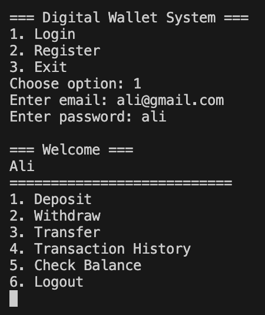
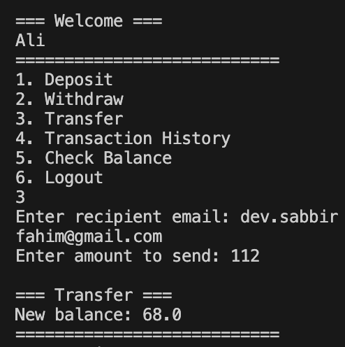
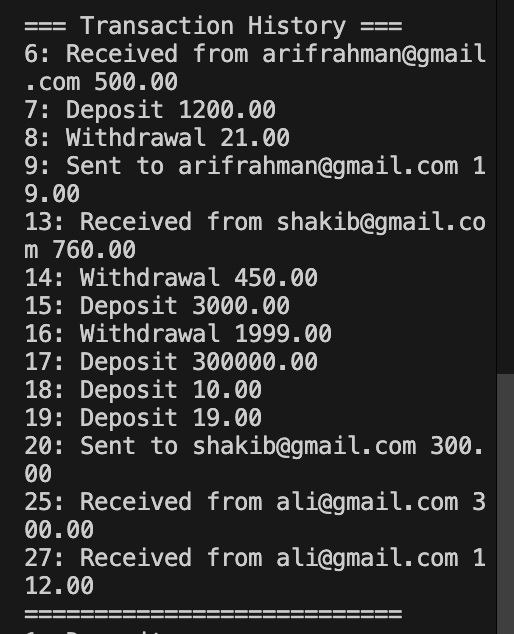
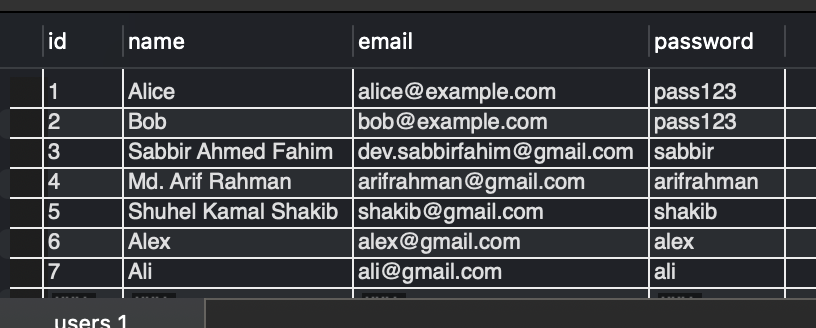
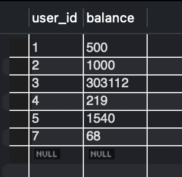
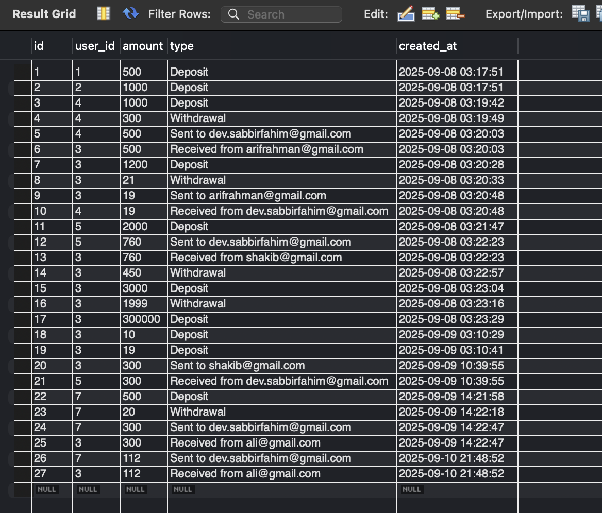

# DigitalWalletLite – Console-Based Java Wallet

DigitalWalletLite is a lightweight Java console application with a MySQL backend.
It’s designed as a simple, easy-to-understand demonstration of how Java programs can interact with a relational database to manage user accounts and transactions.

It was originally developed as part of my university  **Object Oriented Programming (OOP)** and **Database Management System (DBMS)** courses, and represents my first attempt at a coursework project, through which I learned a lot.

## Project Demo

### Main Menu & Login
  
*Welcome screen with user options after login.*

### Transfer Money
  
*Shows the transfer process where a user sends money to another user and the updated balance is displayed.*

### Transaction History
  
*Displays the transaction history for a user, including deposits, withdrawals, sent, and received transfers.*

### Database Tables

#### Users Table


#### Wallets Table


#### Transactions Table


## Prerequisites

Before running, ensure:

- **Java JDK 8+** installed (check with `java -version`)  
  - Needed to compile and run Java programs.
- **IDE recommendation:** VS Code (with Java Extension Pack) or any suitable editor
- MySQL server installed and running (commands provided below)  
- MySQL Connector/J (`mysql-connector-j-8.0.33.jar`) in the `lib/` folder (Google it)  
- Optional but recommended: Install **MySQL Workbench** or any MySQL GUI client for easier visualization of databases, tables, and data.  
- Clone or download the project:  
```bash
git clone <https://github.com/sabbirahmedfahim/DigitalWalletLite/tree/main>
```

## Plug & Play `macOS (Homebrew) Version`

### 1. Open a terminal and navigate to your project folder
(Replace /path/to/DigitalWalletLite with your actual path)
```bash
cd /path/to/DigitalWalletLite
```

### 2. Ensure MySQL is running
```bash
brew services start mysql
brew services stop mysql
brew services list
```

### 3. Compile the Java file
#### macOS / Linux:
```bash
mkdir -p bin
javac -d bin -cp "lib/mysql-connector-j-8.0.33.jar" Main.java
```

### 4. Run the application
#### macOS
```bash
java -cp "bin:lib/mysql-connector-j-8.0.33.jar" Main
```

You're done! 🎉

<details>
<summary style="font-size:20px; font-weight:bold;">Plug & Play (Linux Version)</summary>


### 1. Open a terminal and navigate to your project folder
(Replace /path/to/DigitalWalletLite with your actual path)
```bash
cd /path/to/DigitalWalletLite
```
### 2. Ensure MySQL is running
```bash
sudo systemctl start mysql
sudo systemctl stop mysql
sudo systemctl status mysql
```
### 3. Compile the Java file
```bash
mkdir -p bin
javac -d bin -cp "lib/mysql-connector-j-8.0.33.jar" Main.java
```
### 4. Run the application
```bash
java -cp "bin:lib/mysql-connector-j-8.0.33.jar" Main
```
</details>

<details>
<summary style="font-size:20px; font-weight:bold;">Plug & Play (Windows Version)</summary>


### 1. Open a terminal and navigate to your project folder
(Replace /path/to/DigitalWalletLite with your actual path)
```cmd
cd C:\path\to\DigitalWalletLite
```
### 2. Ensure MySQL is running
```cmd
net start mysql
net stop mysql
```
### 3. Compile the Java file
```cmd
mkdir bin
javac -d bin -cp "lib\mysql-connector-j-8.0.33.jar" Main.java
```
### 4. Run the application
```cmd
java -cp "bin;lib\mysql-connector-j-8.0.33.jar" Main
```
</details>


